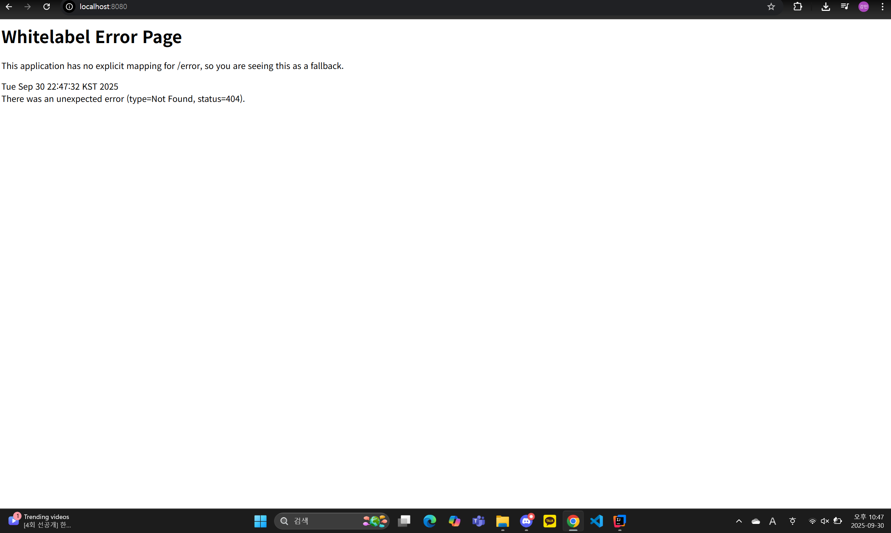

# HW1

## 1주차 WIL
### 웹이란?
- 인터넷:

    전 세계 컴퓨터와 기기를 연결하는 글로벌 네트워크
- 웹:
    인터넷 위에서 동작하는 서비스

### HTTP
- HTTP: 데이터를 주고 받는 프로토콜
  스킴, URL, path 경로, 쿼리 파라미터로 구성됨
### API & REST API
- REST: 네트워크 아키텍처. 
- 구성요소
  - 1. 자원 - URI
  - 2. 행위 - Method
  - 3. 표현 - JSON 데이터 형태
### Spring Boot
- Spring: Java 언어의 'OOP'를 살려내는 개발 틀 플레임워크
- Spring Boot: 복잡한 초기 설정(WAS 등) 간편하게 Spring을 사용할 수 있게 해주는 도구.
## Spring Start

## 쇼핑몰 API 명세서

### 상품 기능
- 상품 정보 등록

  HTTP method : POST

  URI : /items/add
- 상품 목록 조회

  HTTP method : GET

  URI : /items
- 개별 상품 정보 상세 조회

  HTTP method : GET

  URI : /item/{itemId}
- 상품 정보 수정

  HTTP method : PATCH

  URI : /item/{itemId}
- 상품 삭제

  HTTP method : DELETE

  URI : /item/{itemId}

### 주문 기능
- 주문 정보 생성

  HTTP method : POST

  URI : /orders/add
- 주문 목록 조회

  HTTP method : GET

  URI :/orders
- 개별 주문 정보 상세 조회

  HTTP method : GET

  URI :/orders/{orderId}
- 주문 취소

  HTTP method : DELETE

  URI : /orders/{orderId}