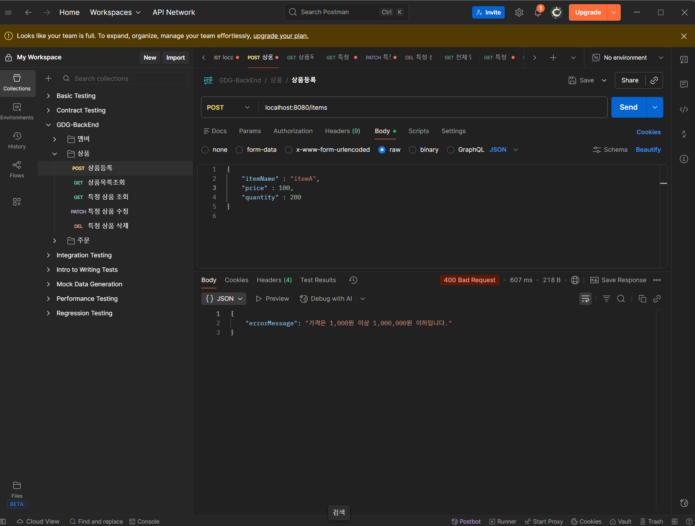
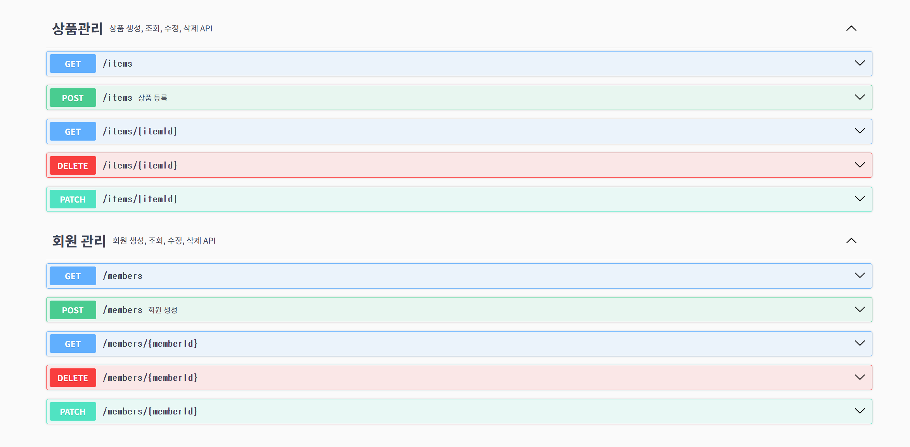

# 데이터의 무결성 보장

## 유효성 검사

- 요청으로 들어오는 데이터가 올바른 형식인 검사하는 것
- Spring: DTO에서 유효성을 검사 `beanvalidation과 @Valid을 통해서 자동으로 검사해준다.`
- 유효성 검사 어노테이션: `@NotNull, @NotEmpty, @Size, @Pattern` → 제약 사항 & 에러 메시지 명시

  @Valid → 제약 조건에 맞는지 **검사**


```java
@Getter
public class MemberCreateRequest {

    @NotNull(message = ErrorMessage.LOGIN_ID_NOT_NULL)
    @Size(min = 4, max = 20, message = ErrorMessage.LOGIN_ID_SIZE)
    private String loginId;

    @NotNull(message = "비밀번호는 필수입니다.")
    @Size(min = 8, max = 20, message = "비밀번호는 8자 이상 20자 이하여야 합니다.")
    private String password;

    @NotNull(message = "전화번호는 필수입니다.")
    @Pattern(regexp = "^010-\\d{4}-\\d{4}$", message = "전화번호 형식이 올바르지 않습니다. 010-xxxx-xxxx")
    private String phoneNumber;

    @NotNull(message = "주소는 필수입니다.")
    private String address;

    public MemberCreateRequest(String loginId, String password, String phoneNumber, String address) {
        this.loginId = loginId;
        this.password = password;
        this.phoneNumber = phoneNumber;
        this.address = address;
    }
}
```

- `ErrorMessage`라는 클래스를 따로 두어 상수 처리 해줄 수 있다.
- `MemberController`에서 DTO에 `@Valid`어노테이션을 추가해주면, DTO 객체에 대한 검증을 `bean validation`이 자동으로 유효성 검사를 해준다.

# 체계적인 오류 관리

## 예외 처리

### 1. Global Exception Handler

- 공통 예외 처리 핸들러: (member, order, product)의 공통 관심사 처리
- 에러 정보 반환용 DTO
- AOP (관점 지향 프로그래밍): 여러 클래스에 걸쳐 반복되는 공통 기능을 분리하여 모듈화하여 처리
- `@ControllerAdvice`:  모든 컨트롤러에서 발생하는 예외를 중앙에서 처리 = 모든 컨트롤러의 공통 관심사를 별도의 클래스로 분리하여 구현

즉, 내가 만든 특정 핸들러에서 처리 하지 못한 예외는 전부 `handleUnknownException` 메서드가 처리한다.

### 2. 커스텀 예외 처리

- RuntimeException을 상속한 커스텀 예외 클래스
1. 존재하지 않는 회원을 조회한 경우 → `NotFoundException` 클래스를 통해 처리
2. 이미 존재하는 로그인 아이디를 입력한 경우 → `BadRequestException` 클래스를 통해 처리

```java
@ControllerAdvice
public class GlobalExceptionHandler {

    // 400
    @ExceptionHandler(MethodArgumentNotValidException.class)
    public ResponseEntity<ErrorResponse> handleMethodArgumentNotValidException(MethodArgumentNotValidException e){
        // 첫번째 에러 메시지 추출
        String message = e.getBindingResult().getAllErrors().get(0).getDefaultMessage();
        ErrorResponse errorResponse = new ErrorResponse(message);
        return ResponseEntity.badRequest().body(errorResponse);
    }

    // 400 Bad Request Exception
    @ExceptionHandler(BadRequestException.class)
    public ResponseEntity<ErrorResponse> handleBadRequestException(BadRequestException e){
        ErrorResponse errorResponse = new ErrorResponse(e.getMessage());
        return ResponseEntity.badRequest().body(errorResponse);
    }

    // 404 Not Found Exception
    @ExceptionHandler(NotFoundException.class)
    public ResponseEntity<ErrorResponse> handleNotFoundException(NotFoundException e){
        ErrorResponse errorResponse = new ErrorResponse(e.getMessage());
        return ResponseEntity.status(HttpStatus.NOT_FOUND).body(errorResponse);
    }

    // 예상치 못한 예외 처리 (500 Internal Server Error)
    // 커스텀 클래스에서 처리하지 못한 모든 예외를 처리한다. (Exception.class)
    @ExceptionHandler(Exception.class)
    public ResponseEntity<ErrorResponse> handleUnknownException(Exception e){
        ErrorResponse errorResponse = new ErrorResponse(e.getMessage());
        return ResponseEntity.internalServerError().body(errorResponse);
    }
}
```

- 모든 ExceptionHandler를 처리해주는 역할을 한다. 만약 exception이 발생된다면, controller계층까지 가지 않고, 이 핸들러로 오게 된다.
- 가장 위부터 커스텀 예외 핸들러를 통과하게 되고, 만약 정의한 커스텀 핸들러가 없다면, 모든 예외를 처리하는 `handleUnknownException`에 가게 된다. 그리고 json형태로 미리 컨트롤러에서 정의한 **errorResponse**를 출력해준다.

```java
@Service
@RequiredArgsConstructor
@Primary
public class MemberServiceImpl implements MemberService{

    private final MemberRepository memberRepository;

    // 회원 등록
    @Transactional
    @Override
    public Long createMember(MemberCreateRequest request){
        Member exisitingMember = memberRepository.findByLoginId(request.getLoginId());
        if (exisitingMember != null){
            throw new BadRequestException(ErrorMessage.MEMBER_ALREADY_EXISTS);
        }

        Member member = new Member(
                request.getLoginId(),
                request.getPassword(),
                request.getPhoneNumber(),
                request.getAddress());
        memberRepository.save(member);
        return member.getId();
    }

    // 회원 목록 조회
    @Transactional
    @Override
    public List<Member> getAllMembers(){
        return memberRepository.findAll();
    }

    // 개별 회원 정보 상세 조회
    @Transactional
    @Override
    public Member getMember(Long id){
        if (memberRepository.findById(id) == null){
            throw new NotFoundException(ErrorMessage.MEMBER_NOT_FOUND);
        }
        return memberRepository.findById(id);
    }

    // 회원 정보 수정
    @Transactional
    @Override
    public void updateMember(Long id, MemberUpdateRequest request){
        Member member = memberRepository.findById(id);

        if (member == null){
            throw new NotFoundException(ErrorMessage.MEMBER_NOT_FOUND);
        }

        String password = (request.getPassword() != null) ? request.getPassword() : member.getPassword();
        String phoneNumber = (request.getPhoneNumber() != null) ? request.getPhoneNumber() : member.getPhoneNumber();
        String address = (request.getAddress() != null) ? request.getAddress() : member.getAddress();

        member.updateInfo(password, phoneNumber, address);
    }

    // 회원 삭제
    @Transactional
    @Override
    public void deleteMember(Long id){
        memberRepository.deleteById(id);
    }
}
```

- `GlobalExceptionHandler호출과정`: Exception이 던져지면, 에러 메시지와 함께 GlobalExceptionHandler를 가서 커스텀 예외 메서드를 찾게 된다. 못찾으면 handleUnknownException 메서드로. 그리고 json 형태로 그 메시지를 출력해준다.

### 3. 에러 메시지 클래스

- 예외 메시지 문자열이 중복 사용된다. → 상수로 정의

```java

public static final String MEMBER_NOT_FOUND = “회원을 찾을 수 없습니다.”;
public static final string MEMBER_ALREADY_EXISTS = “이미 존재하는 로그인 아이디입니다.”;
```

# 협업을 위한 API 명세

## API 문서화 → Swagger

- API 사용 설명서 공유
- 백엔드 API 명세를 문서로 공유
1. Spring Doc 사용 → OpenAPI 규격의 API 문서 생성
2. Swagger UI 사용 → API 문서에 Swagger 디자인 적용

### API 문서화 작업을 위한 어노테이션

- `@Tag`: API 그룹화
- `@Operation`: API의 요약과 설명
- `@ApiResponse`:  단일 응답 코드 설명
```@RestController
@RequiredArgsConstructor
@RequestMapping("/members")
@Tag(name = "회원 관리", description = "회원 생성, 조회, 수정, 삭제 API")
public class MemberController {

    private final MemberService memberService;

    // 회원 생성
    @PostMapping
    @Operation(summary = "회원 생성", description = "새로운 회원을 등록합니다.")
    @ApiResponse(responseCode = "400", description = "잘못된 요청 (유효성 검사 실패 또는 중복된 로그인 아이디")
    public ResponseEntity<Void> createMember(@RequestBody @Valid MemberCreateRequest request){
        Long memberId = memberService.createMember(request);
        return ResponseEntity.created(URI.create("/members/" + memberId)).build();
    }
    ...
}
```

